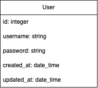

# FastAPI Simple Starter

FastAPI simple starter template :goat: :goat: :goat:

## Getting Started

### Prerequisites

- Python version: `python 3.9.5`
- FastAPI version: `fastapi 0.95.0`
- uvicorn: `uvicorn 0.21.1`
- Database: `postgresql`

## Installation

- Clone the repository: `git clone https://github.com/GoldenOwlAsia/python-fast-api-template.git`
- Install virtual environment:
`sudo pip3 install virtualenv`
`virtualenv -p python3 myenv`
- Activate virtual environment: `source ./myenv/bin/activate`
- Go to python-fast-api-template folder: `cd ./python-fast-api-template`
- Install the dependencies: `pip install -r requirements.txt`
- Create .env file:
```
POSTGRES_URL=postgresql://postgres:@localhost/fast_api_template
SENTRY_KEY=https://56320b25f78b42bdb0b672792b001b2a@o4504692869038080.ingest.sentry.io/4505017145425920
```
- Create database in PosgresSQL database: `fast_api_template` and `fast_api_template_test`
- Run migration: `alembic upgrade head`
- Run application: `uvicorn main:app --reload`
- Visit `http://127.0.0.1:8000` and start your development
- Account
```
username: superadmin
password: 1234

username: admin
password: 1234
```
## API documentation

- Visit `http://127.0.0.1:8000/docs` to watch API documentation

## Testing

- Run test by `pytest`

## Database diagram


